# Products CRUD API com RabbitMQ, JWT e Notificações por Email


> API de CRUD de produtos com autenticação via JWT, filas RabbitMQ e envio de notificações por email a cada operação realizada.
> Segue **Arquitetura Limpa (Clean Architecture)**, separando camadas de domínio, caso de uso, infraestrutura e interface.

### Linguagem e Ferramentas Principais


### Frameworks e Bibliotecas


### Infraestrutura e Banco de Dados


### Plataformas e Documentação


### Status do Projeto


### Sumário

* [URL de Produção](#-url-de-produção)
* [Descrição do Projeto](#-descrição-do-projeto)
* [Funcionalidades](#-funcionalidades)
* [Fluxo Completo da API](#-fluxo-completo-da-api)
* [Estrutura do Projeto](#-estrutura-do-projeto)
* [Automação e Desenvolvimento](#️-automação-e-desenvolvimento-local)
    * [Makefile](#makefile)
    * [Live Reload com Air](#live-reload-com-air)
* [Testes Automatizados](#-testes-automatizados)
    * [Cobertura de Testes](#️-cobertura-de-testes)
    * [Como Rodar os Testes](#️-como-rodar-os-testes)
* [Como Rodar o Projeto](#-como-rodar-o-projeto)
    * [Desenvolvimento Local](#️-desenvolvimento-local)
* [Fluxo de Notificações (Emails)](#-fluxo-de-notificações-emails)

### 🌐 URL de Produção

A API está disponível em produção no Render: [https://products-crud-kh.onrender.com](https://products-crud-kh.onrender.com)  

> ⚠️ A URL principal não retorna conteúdo, serve apenas para expor as rotas.  

Swagger disponível em: [https://products-crud-kh.onrender.com/swagger/index.html](https://products-crud-kh.onrender.com/swagger/index.html)


### 📖 Descrição do Projeto

Este projeto foi desenvolvido em **Golang** com arquitetura limpa e organizada em **camadas**, seguindo os princípios da **Arquitetura Limpa**:

- **Domain**: Modelos e regras de negócio (produto, usuário).  
- **Usecase**: Casos de uso, lógica de aplicação.  
- **Handler / API**: Camada de interface, endpoints HTTP com Gin.  
- **Infrastructure**: Banco de dados (Neon/PostgreSQL), RabbitMQ, envio de emails, logging.  

### ⚡ Funcionalidades

#### CRUD de Produtos
- Criar, ler, atualizar e deletar produtos.
- Validação automática de dados.

#### Autenticação JWT
- Geração de token JWT ao logar.
- Proteção de rotas sensíveis.

#### RabbitMQ
- Publica eventos em filas (`publisher.go`).
- Consome eventos (`consumer.go`) e envia emails de notificação.

#### Email Notifications
- Emails detalhados de operações CRUD.
- Configuração flexível via `.env`.

#### Swagger
- Documentação interativa disponível em ambiente de desenvolvimento e em produção.

---

### 🔄 Fluxo Completo da API

```mermaid
flowchart TD
    %% Seção Autenticação
    subgraph Auth [Autenticação]
        direction TB
        A1[Registrar Usuário] -->|POST /api/register| A2[Usuário Criado]
        A2 --> A3[Login] 
        A3 -->|POST /api/login| A4[Recebe JWT Token]
        A4 --> A5[Token usado nas requisições protegidas]
    end

    %% Seção CRUD de Produtos
    subgraph Products [CRUD de Produtos]
        direction TB
        A5 --> B1[Criar Produto] -->|POST /products| B2[Produto Criado]
        A5 --> B3[Listar Produtos] -->|GET /products| B4[Produtos Retornados]
        A5 --> B5[Atualizar Produto] -->|PUT /products/:id| B6[Produto Atualizado]
        A5 --> B7[Deletar Produto] -->|DELETE /products/:id| B8[Produto Removido]
    end

    %% Seção Notificações
    subgraph Notifications [Notificações por Email]
        direction TB
        B2 --> C1[Publica evento no RabbitMQ]
        B6 --> C1
        B8 --> C1
        C1 --> C2[Consumer consome evento]
        C2 --> C3[Envia email de notificação]
    end
```


> ⚠️ Todas as rotas foram projetadas para aceitar apenas um produto ou um batch de produtos. Qualquer erro de validação em um único produto não impedirá os demais de serem criados/atualizados/deletados.

### 📂  Estrutura do Projeto

```text
.
├── cmd
│   ├── api
│   │   ├── docs
│   │   │   ├── docs.go
│   │   │   ├── swagger.json
│   │   │   └── swagger.yaml
│   │   └── main.go
│   └── consumer
│       └── consumer.go
├── internal
│   ├── config
│   │   └── config.go
│   ├── domain
│   │   ├── messaging
│   │   │   ├── consumer.go
│   │   │   └── publisher.go
│   │   ├── model
│   │   │   ├── product.go
│   │   │   └── user.go
│   │   ├── repository
│   │   │   ├── product.go
│   │   │   └── repository.go
│   │   └── usecase
│   │       ├── usecase_auth_domain.go
│   │       └── usecase_product_domain.go
│   ├── dtos
│   │   ├── product_dtos.go
│   │   ├── swagger_dtos.go
│   │   └── user_dto.go
│   ├── handler
│   │   ├── auth_handler.go
│   │   ├── middleware
│   │   │   └── middleware.go
│   │   ├── product_handler.go
│   │   └── validator
│   │       ├── product_validator.go
│   │       └── user_validator.go
│   ├── infrastructure
│   │   ├── database
│   │   │   └── db.go
│   │   ├── logger
│   │   │   └── logger.go
│   │   ├── messaging
│   │   │   └── messaging.go
│   │   └── repository
│   │       ├── product_repository.go
│   │       └── user_repository.go
│   ├── server
│   │   ├── routes.go
│   │   └── server.go
│   └── usecase
│       ├── auth_usecase.go
│       ├── product_usecase.go
│       └── test
│           ├── auth_usecase_test.go
│           └── product_usecase_test.go
├── Makefile
├── docker-compose.yml
├── go.mod
├── go.sum
├── .env
```

## ⚙️ Automação e Desenvolvimento Local

Para otimizar o fluxo de trabalho, o projeto conta com ferramentas de automação para tarefas comuns e live reload durante o desenvolvimento.

### Makefile

O `Makefile` centraliza os comandos mais utilizados, simplificando a interação com o projeto.

| Comando            | Descrição                                                                               |
| ------------------ | ----------------------------------------------------------------------------------------- |
| `make docker-run`  | Sobe todos os containers (API, banco de dados, etc.) definidos no `docker-compose.yml`.   |
| `make docker-down` | Para e remove todos os containers da aplicação.                                           |
| `make run`         | **Inicia a API localmente em modo de desenvolvimento com live reload via `Air`.** |
| `make build`       | Compila o código fonte da API e gera o binário executável.                                |
| `make test`        | Executa a suíte de testes do projeto.                                                     |
| `make install-tools` | Instala as dependências e ferramentas de linha de comando necessárias para o projeto.   |
| `make clean`       | Remove os arquivos binários gerados pela compilação.                                      |

### Live Reload com Air

Para agilizar o desenvolvimento, este projeto utiliza a ferramenta [Air](https://github.com/air-verse/air) para live reloading.

Ao executar o comando `make run`, o Air monitora todas as alterações nos arquivos do projeto (como `.go`, `.env`, etc.). Ao detectar uma mudança, ele automaticamente recompila e reinicia o servidor da API.

Isso elimina a necessidade de parar e iniciar o servidor manualmente a cada alteração, tornando o ciclo de desenvolvimento muito mais rápido e produtivo. As configurações específicas do Air para este projeto podem ser encontradas no arquivo `.air.toml`.

## 🧪 Testes Automatizados

O projeto possui testes para garantir que os casos de uso funcionem corretamente e que a comunicação com o RabbitMQ esteja estável.  

#### 🏗️ Cobertura de Testes

- **Autenticação (AuthUsecase)**
  - Login com sucesso usando email e senha corretos.
  - Falha ao usar senha incorreta.
  - Falha ao tentar logar com usuário inexistente.
  - Uso de variáveis de ambiente simuladas (`mockEnv`) para consistência nos testes.

- **Gerenciamento de Produtos (ProductUseCase)**
  - Criação de produtos válidos.
  - Criação de produtos com erros de validação (ex.: nome vazio).
  - Falha na publicação de eventos no RabbitMQ.
  - Atualização de produtos existentes e tratamento de produtos não encontrados.
  - Exclusão de produtos e tratamento de produtos não encontrados.
  - Recuperação de produtos via `GetAll` e `GetBySKU`.

#### ⚙️ Como Rodar os Testes

```bash
make test
```

## 🚀 Como Rodar o Projeto

### ⚙️ Desenvolvimento Local

1.  **Clone o repositório**
    ```bash
    git clone https://github.com/Amandasilvbr/products-crud.git
    ```

2.  **Instale as ferramentas necessárias**
    ```bash
    make install-tools
    ```

3.  **Configure variáveis de ambiente**
    Copie o arquivo de ambiente de desenvolvimento e substitua:
    ```bash
    # DB development credentials
    DB_DATABASE=<DB_DATABASE>
    DB_HOST=<DB_HOST>
    DB_PORT=<DB_PORT>
    DB_USERNAME=<DB_USERNAME>
    DB_PASSWORD=<DB_PASSWORD>
    
    # Base API URL
    API_URL=<API_URL>
    
    # Determines the application's running environment (e.g., development, production)
    APP_ENV=<APP_ENV>
    
    # A secret key used for signing and verifying JSON Web Tokens (JWT)
    JWT_SECRET_KEY=<JWT_SECRET_KEY>
    
    # The url for connecting to the RabbitMQ message broker
    RABBITMQ_URL=<RABBITMQ_URL>
    
    # The hostname of the SMTP server used for sending emails
    SMTP_HOST=<SMTP_HOST>
    
    # The port number for the SMTP server
    SMTP_PORT=<SMTP_PORT>
    
    # The username for authenticating with the SMTP server
    SMTP_USER=<SMTP_USER>
    
    # The password for the SMTP user
    SMTP_PASSWORD=<SMTP_PASSWORD>
    
    # The email address that will appear as the sender ('From' field) in emails
    SMTP_FROM=<SMTP_FROM>
    ```
    Ajuste as variáveis no `.env` se necessário (ex: conexão com o Neon, credenciais do RabbitMQ).

4.  **Suba os containers necessários para o rabbit e o banco de dados**
    ```bash
    make docker-run
    ```
    Isso iniciará o RabbitMQ e outros serviços que a API depende.

5.  **Compile e execute a API com live reload**
    ```bash
    air
    ```

6.  **Acesse a API e Swagger**
    - **API**: `http://localhost:8988`
    - **Swagger**: `http://localhost:8988/swagger/index.html`

7.  **Rodar os testes**
    ```bash
    make test
    ```
## 📨 Fluxo de Notificações (Emails)

A cada operação CRUD (CREATE, UPDATE, DELETE), a API publica um evento no RabbitMQ, que é consumido pelo Consumer e envia um email de notificação, seguindo o fluxograma abaixo.
> ⚠️ Na rota register, registre um e-mail real para que o envio seja realizado. 

```mermaid
graph TD
    A[API recebe requisição CRUD] --> B(RabbitMQ: publica evento)
    B --> C(Consumer: consome evento)
    C --> D[Envia email de notificação]
    D --> E[Email contém detalhes da operação]
```

<br>
<br>


#### Exemplo: operação CREATE

<div align="center">
  
</div>


---

<p align="center">
  Desenvolvido por <strong>Amanda Brunelli 
</p>
